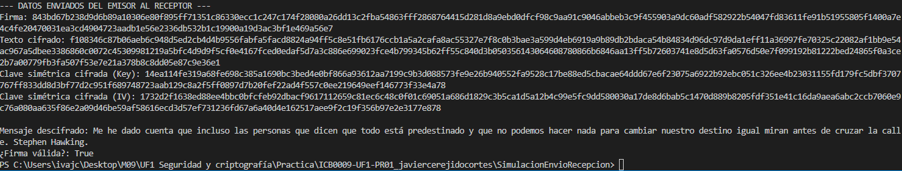

# Simulador de Envío y Recepción Segura de Mensajes

---

## Descripción General

Este proyecto es una simulación de envío y recepción de un mensaje entre un **emisor** y un **receptor**, aplicando técnicas de seguridad criptográfica: **firma digital, cifrado simétrico y cifrado asimétrico**.

Se compone de dos partes:

1. Registro/Login seguro de usuarios usando `bcrypt`
2. Simulación completa de envío y recepción segura de un mensaje

---

## Tecnologías y librerías utilizadas

- **C# (.NET)**
- `System.Security.Cryptography`
- `BCrypt.Net-Next` (para hasheo seguro)
- Criptografía simétrica: **AES**
- Criptografía asimétrica: **RSA**

---

## Estructura de la práctica

### Parte 1: Registro y Login Seguro

- El usuario puede registrarse con nombre de usuario y contraseña.
- La contraseña se guarda utilizando `bcrypt`, que:
  - Genera un salt aleatorio
  - Realiza un hasheo seguro
- El login valida comparando el hash almacenado con la contraseña introducida usando `BCrypt.Verify`.

---

### Parte 2: Simulación del Envío y Recepción

#### LADO EMISOR

1. **Firma del mensaje**  
   Se firma el mensaje original usando la clave privada del emisor.  
   `Emisor.FirmarMensaje(byte[])`

2. **Cifrado del mensaje con AES**  
   Se utiliza una clave simétrica generada automáticamente.  
   `ClaveSimetricaEmisor.CifrarMensaje(string)`

3. **Cifrado de la clave simétrica con RSA**  
   Tanto la clave como el IV se cifran con la clave pública del receptor.  
   `Emisor.CifrarMensaje(byte[], Receptor.PublicKey)`

---

#### LADO RECEPTOR

4. **Descifrado de la clave simétrica**  
   Se descifra la clave simétrica y el IV con la clave privada del receptor.  
   `Receptor.DescifrarMensaje(byte[])`

5. **Descifrado del mensaje**  
   Se utiliza la clave simétrica recibida para descifrar el mensaje.  
   `ClaveSimetricaReceptor.DescifrarMensaje(byte[])`

6. **Comprobación de la firma**  
   Se verifica que el mensaje no haya sido alterado.  
   `Receptor.ComprobarFirma(firma, mensaje, Emisor.PublicKey)`

---

## Ejemplo de salida esperada




---

## Pregunta final

¿Se puede eliminar algún método de ClaveAsimetrica?

✅ **Sí**. El método:

```csharp
public byte[] FirmarMensaje(byte[] MensajeBytes, RSAParameters ClavePublicaExterna)


## Autor
**Javier Cerejido Cortés**